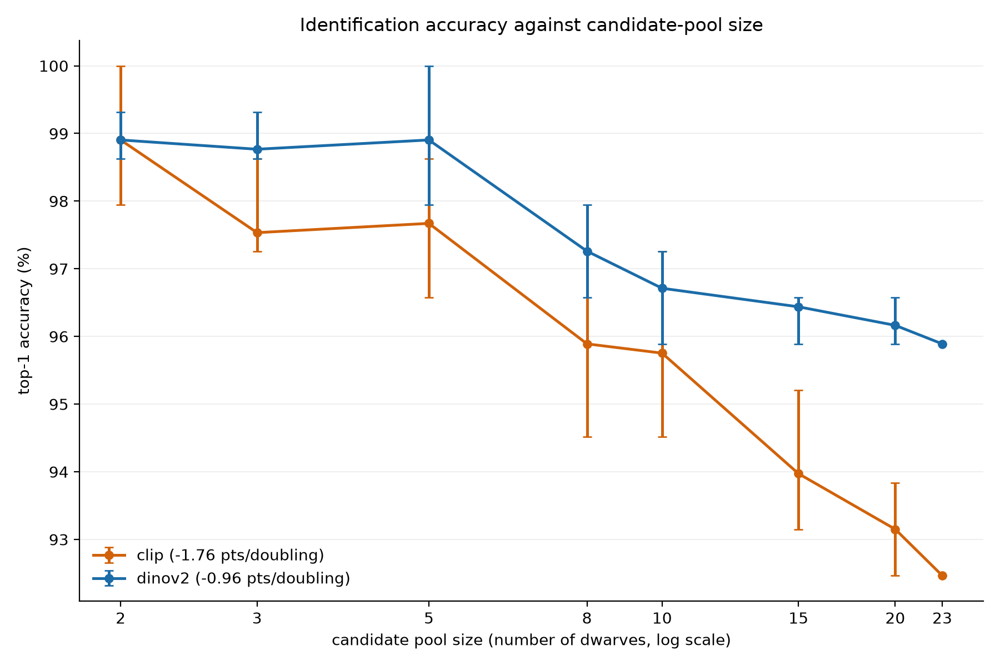
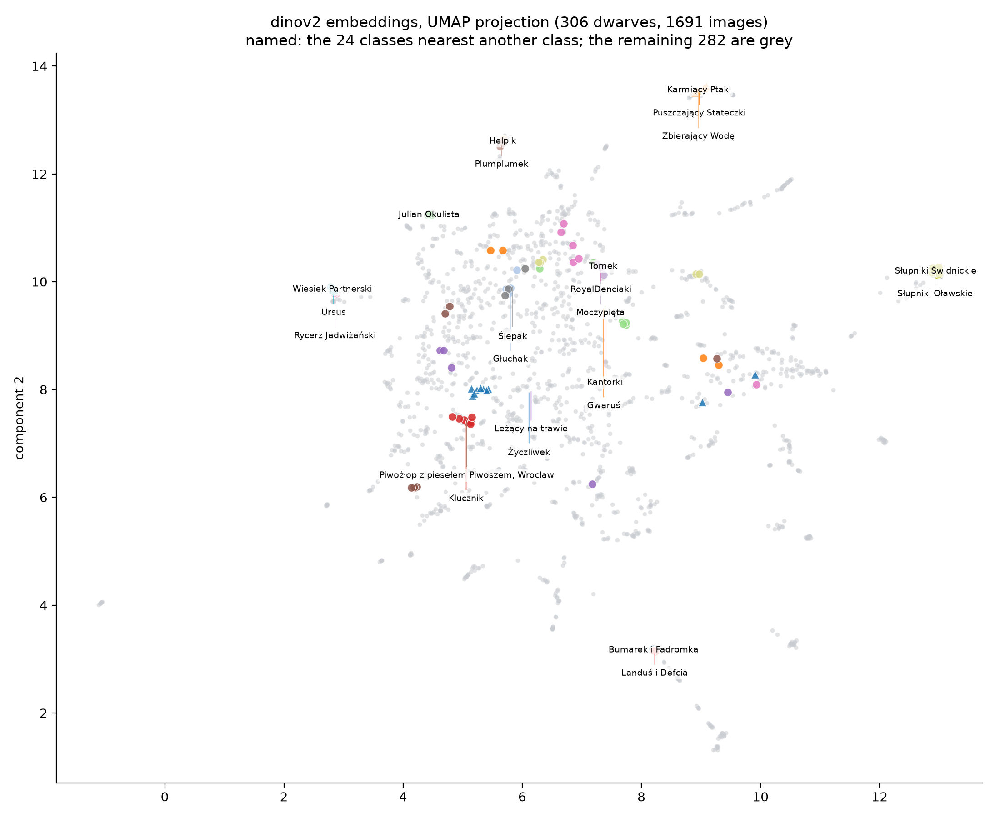
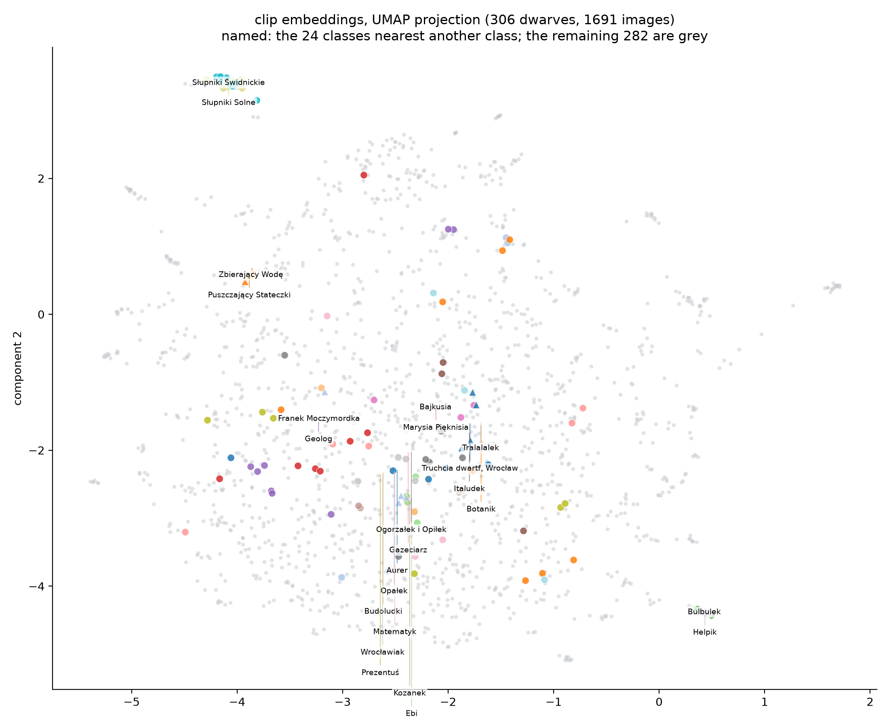

# How far does visual instance recognition get you on Wrocław's dwarves?

Wrocław is scattered with several hundred small bronze dwarf statues. They are individually
sculpted but share a visual vocabulary: the same scale, the same material, the same crouching
poses and hand-held props. That makes telling one from another a **fine-grained instance
recognition** problem rather than a classification problem, and it makes one question worth
asking properly:

> Identification gets harder as the candidate pool grows. If the pool can be narrowed — by
> location, say — how much does accuracy actually improve, and at what pool size does this
> become a reliable way to identify a statue?

This repository answers that with a measured curve rather than a single accuracy number.

## Summary of findings

1. **Off-the-shelf embeddings identify these statues well.** DINOv2 reaches 95.9% top-1 and
   99.3% top-5 across the full 23-dwarf pool, with no fine-tuning at all.
2. **Accuracy decays slowly, and the backbones diverge.** DINOv2 loses 0.96 accuracy points per
   doubling of the candidate pool; CLIP loses 1.76. The gap between them *widens* with pool size,
   so backbone choice matters more the harder the problem gets.
3. **Narrowing by location helps less than the simulation suggests.** Real proximity-based pools
   are consistently *harder* than random pools of the same size, because the statues that are
   hardest to tell apart were installed together as a themed group.
4. **Training a classifier does not help.** A per-fold linear probe gains 0.7 top-1 points over
   raw retrieval and per-class prototypes lose 2 to 3, with every difference inside the
   confidence intervals. At this data scale, nearest-neighbour retrieval is already the right
   tool.
5. **The errors are explainable, not random.** Both backbones concentrate their mistakes on the
   same small cluster of water-themed dwarves, which the embedding projections show as a single
   tight neighbourhood.

## Dataset

| | |
|---|---|
| Dwarves (classes) | 23 |
| Reference photographs | 146 |
| Images per dwarf | 3 to 31 (median 4) |
| Source | Wikimedia Commons, via Wikidata class `Q136276280` |
| Licences | Public Domain, CC0, CC BY, CC BY-SA only |

Coverage is bounded by data quality, not geography: a dwarf is included only if it has at least
three usable Creative Commons photographs. 40 Wikidata-to-Commons category mappings were reviewed
by hand; 23 survived the image threshold.

Three details matter more than the headline count:

- **Attribution is a first-class field.** Every stored image carries its source URL, author,
  licence and licence URL. Nothing enters the manifest without them.
- **Cross-label duplicates are excluded.** Twenty Commons files turned out to be byte-identical
  across *different* dwarf labels. Admitting them would have leaked the answer into the reference
  set, so they were dropped even though four classes lost their only images as a result.
- **Evaluation is leave-one-out.** Each of the 146 images is queried once against the other 145.
  The split is hash-pinned to the manifest, and any experiment run against a stale split fails
  loudly instead of quietly producing plausible numbers.

## Method

Images are embedded with two frozen backbones — **DINOv2** (`facebook/dinov2-base`, 768-d) and
**CLIP** (`openai/clip-vit-base-patch32`, 512-d) — and ranked by cosine similarity. No
fine-tuning. Each backbone is pinned to an immutable revision that serves safetensors directly,
so the provenance recorded alongside every cached vector describes the weights actually loaded.

Candidates are ranked as **distinct dwarves**, each represented by its best-matching photograph.
That is the list an identification tool would show a user, and it is what every metric below
scores.

## 1. Baseline: the full candidate pool

All 23 dwarves are candidates for every query. Intervals are 95% Wilson score intervals over 146
queries.

| | DINOv2 | CLIP |
|---|---|---|
| top-1 | **95.9%** [91.3, 98.1] | **92.5%** [87.0, 95.7] |
| top-5 | 99.3% [96.2, 99.9] | 98.6% [95.1, 99.6] |
| MRR | 0.971 | 0.951 |

DINOv2 leads, which is the expected ordering: it is trained with a self-supervised objective that
preserves instance-level detail, while CLIP's language-alignment objective pushes toward semantic
categories — and every one of these statues *is* the same semantic category.

## 2. The headline result: accuracy against candidate-pool size

Each query is scored against its own dwarf plus N−1 randomly drawn others, repeated over five
seeds per pool size. Error bars are the observed spread across seeds.



| pool size | DINOv2 | CLIP |
|---|---|---|
| 2 | 98.9% | 98.9% |
| 5 | 98.9% | 97.7% |
| 10 | 96.7% | 95.8% |
| 15 | 96.4% | 94.0% |
| 20 | 96.2% | 93.2% |
| 23 (full) | 95.9% | 92.5% |
| **points lost per doubling** | **−0.96** | **−1.76** |

Two things stand out. The decay is **shallow** — narrowing the pool from 23 candidates to 5 buys
DINOv2 only three accuracy points, so location-based narrowing is worth far less than intuition
suggests at this scale. And the two backbones **diverge**: they are indistinguishable at a pool of
2 and six points apart at 23. A backbone comparison run only at one pool size would have missed
that entirely, which is the argument for measuring the curve rather than a point.

### What this implies at city scale, and why to distrust it

Extrapolating the fit to the full set of roughly 1,400 dwarves gives 88.5% top-1 for DINOv2 and
78.9% for CLIP. **Treat those as an optimistic bound, not a prediction.** It is a six-doubling
extrapolation, and the distractors here are drawn from a 23-class population; a real city-scale
pool contains far more genuinely confusable statues — shared poses, shared props, shared castings
— so the true curve should fall faster than a log-linear fit. The honest claim this data supports
is about the *rate* of decay in the measured range, not about where the line crosses a threshold.

## 3. Does narrowing by location actually help?

The pools above are sampled at random. The real proposal is to narrow by *location*, and every
dwarf in this dataset carries Wikidata coordinates, so that can be measured rather than assumed.
Each query is pooled with its **N−1 nearest** dwarves instead of N−1 random ones — same pool size,
only the selection rule changes.

| pool size | DINOv2 random | DINOv2 geographic | difference | median radius |
|---|---|---|---|---|
| 3 | 98.8% | 98.6% | −0.1 | 190 m |
| 5 | 98.9% | 97.3% | **−1.6** | 260 m |
| 8 | 97.3% | 96.6% | −0.7 | 390 m |
| 10 | 96.7% | 96.6% | −0.1 | 398 m |
| 15 | 96.4% | 96.6% | +0.1 | 571 m |
| 23 (full) | 95.9% | 95.9% | 0.0 | — |

**Geographic pools are harder than random pools of the same size.** CLIP shows it more strongly:
−2.5 points at a pool of 5, −2.1 at 8, −1.9 at 10. The effect is small in absolute terms but it
runs the wrong way at almost every size, and it has a clear cause.

### Why: the statues you can't separate are standing together

Six of the 23 dwarves sit **within one metre of each other** — 15 of the 253 pairs in this dataset
are effectively co-located. They are the group installation that includes *Puszczający Stateczki*,
*Zbierający Wodę* and *Karmiący Ptaki*.

Those are the same statues the confusion analysis flags, and the same tight neighbourhood the
embedding projection shows. Three of DINOv2's five confused pairs are at zero metres apart.

That is the finding: **the dwarves that are hardest to tell apart were installed as a themed
group, so they share a sculptor, a pose vocabulary and a location.** Location narrowing cannot
separate them — it guarantees they land in the same pool. A random-subsampling simulation, which
scatters the confusable statues across different pools, therefore *overstates* how much
location narrowing buys.

The practical reading for a location-aware tool: a 400 m radius around a visitor covers about ten
candidates, and identification within that pool runs at 96.6% top-1 for DINOv2. Useful — but no
better than picking ten dwarves at random, and for exactly the reason that makes the problem
interesting.

## 4. Does a trained classifier beat retrieval?

All three methods scored on the same folds, with one classifier fitted per fold so no query is
ever in its own training data.

| method | DINOv2 top-1 | CLIP top-1 | gain over retrieval |
|---|---|---|---|
| cosine retrieval | 95.9% | 92.5% | — |
| linear probe | 96.6% | 93.2% | +0.7 pts (both) |
| class prototypes | 93.2% | 90.4% | −2.7 / −2.1 pts |

**No.** The probe's gain is one extra correct query out of 146, well inside the confidence
intervals. Prototypes actively hurt: averaging a class into one vector discards the pose and
viewpoint variation that makes a specific photograph matchable.

A caveat about how this number was reached, because it nearly became a wrong conclusion. At
scikit-learn's conventional `C=1.0` the probe scored **66%**, which looks like a decisive result
and is really just underfitting: the embeddings are L2-normalised, so per-dimension magnitudes sit
near `1/√d` and that penalty crushes the weights. At `C=100` it scores 96.6%. A badly-regularised
baseline is worse than no baseline, because it flatters whatever it is compared against.

## 5. Where the errors are

DINOv2 misidentifies 6 of 146 queries; CLIP misidentifies 11. Because outright errors are rare,
the analysis records the strongest *wrong* candidate for every query, not only for the failures —
that is where the signal is on a dataset this size.

| | DINOv2 | CLIP |
|---|---|---|
| top-1 errors | 6 / 146 (4.1%) | 11 / 146 (7.5%) |
| mean margin over the best wrong dwarf | 0.248 | 0.064 |

The mean margin is the more revealing number. CLIP's embedding space is roughly four times
tighter, which is the same finding as its steeper decay curve seen from another angle: less
headroom per comparison means each added candidate costs more.

The errors are systematic. The most-confused pairs are dominated by the water-themed dwarves —
*Puszczający Stateczki* (releasing little boats), *Zbierający Wodę* (collecting water) and
*Karmiący Ptaki* (feeding birds) — crouching figures with similar props, frequently photographed
from the same angle. *Puszczający Stateczki → Zbierający Wodę* appears in **both directions** for
DINOv2 at a negative margin, and CLIP produces the same cluster with *Karmiący Ptaki* substituted.

Confusion is also **asymmetric**, which is why the analysis keeps pair direction rather than
averaging it away: *100matolog → Kowal* misidentifies 1 of 4 queries, while *Kowal → 100matolog*
misidentifies 0 of 10.



The projection corroborates it independently. Most dwarves form clean, well-separated islands —
which is why accuracy is high — while the confused water-themed dwarves sit together in one tight
neighbourhood in the upper right. The CLIP projection shows the same cluster in a visibly more
compressed space:



## Limitations

- **23 classes is a small pool.** The full pool is close to the accuracy ceiling, which is why
  the curve is shallow and why extrapolation past it is unreliable. Lowering the image threshold
  to two was measured rather than assumed: it adds four classes and does not change the curve.
- **Reference photographs are not a phone camera.** These are Commons uploads — mostly good
  light, considered framing. Real query photos would be worse, and this design cannot say by how
  much.
- **The geographic result rests on 23 statues.** The co-located group that drives it is one
  installation; whether the pattern holds city-wide is untested. Wikidata may also assign group
  members one shared point rather than individual positions, so "within one metre" may reflect
  the record as much as the pavement — either way those statues are co-located.
- **A query outside the reference set still returns neighbours.** There is no open-set rejection;
  the system cannot say "I don't know this one."

## Reproducing this

```bash
uv sync --extra ml --extra analysis
export KRASNAL_ID_USER_AGENT='krasnal-id/0.0.0 (mailto:you@example.com)'

uv run krasnal-id data query                                  # Wikidata discovery
uv run krasnal-id data fetch                                  # Commons acquisition
uv run krasnal-id data build-manifest                         # validated manifest
uv run krasnal-id data build-split                            # leave-one-out folds
uv run krasnal-id embeddings extract --override backbone=dinov2
uv run krasnal-id experiment baseline                         # section 1
uv run krasnal-id experiment pool-ablation                    # section 2
uv run krasnal-id experiment geo-ablation                     # section 3
uv run krasnal-id experiment probe                            # section 4
uv run krasnal-id experiment confusion                        # section 5
uv run krasnal-id visualize ablation
uv run krasnal-id visualize embeddings
```

Every experiment writes a structured JSON artifact to `results/`. Embeddings are cached by image
content hash and backbone revision, so nothing is recomputed between runs. See the
[README](README.md) for the full command reference and [AGENTS.md](AGENTS.md) for the recorded
design decisions behind each of these choices.
